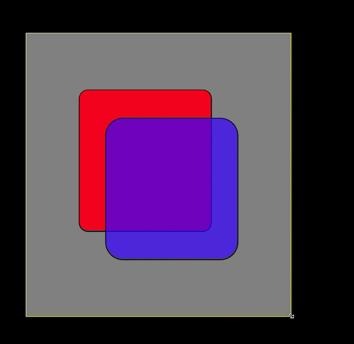

# @cutting/svg - reusable svg components for SVG documents
[](https://www.npmjs.com/package/@cutting/svg)
[](https://github.com/prettier/prettier)

## install 

```sh
yarn add @cutting/svg

# or

npm install @cutting/svg
```

## ParentsizeSVG

A react component that will resize and scale to the dimensions of the supplied react [ref object](https://reactjs.org/docs/refs-and-the-dom.html).



The `ParentsizeSVG` component takes an `elementRef` prop that should point to a valid HTML DOM element.

## usage

```ts
import type { FC } from 'react';
import { useRef } from 'react';
import { ParentsizeSVG } from '@cutting/svg';

export const App: FC = () => {
  const ref = useRef<HTMLDivElement>(null);

  return (
    <div className={styles.container} ref={ref}>
      <ParentsizeSVG ref={ref}>
        <rect
          x="20%"
          y="20%"
          width={'50%'}
          height={'50%'}
          rx="20"
          style={{ fill: '#ff0000', stroke: '#000000', strokeWidth: '2px' }}
        />
      </ParentsizeSVG>
    </div>
  );
};
```