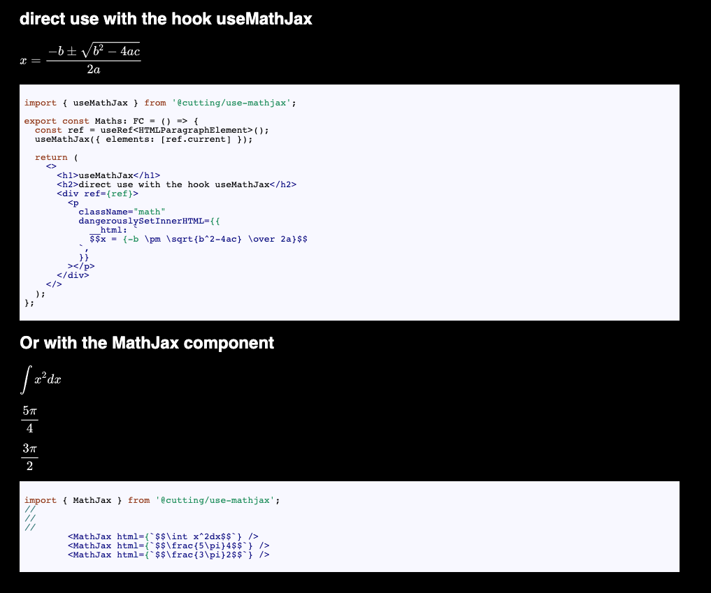

# @cutting/use-mathjax

A React component and hook to easily load [MathJax version 3](https://github.com/mathjax/MathJax-src) Text content.




## install 

```sh
yarn add @cutting/use-mathjax
```

## MathJaxProvider

Both `useMathJax` and `MathJax` will fail if the current component is not a descendant of the `MathJaxProvider`:

```ts
export { MathJaxProvider } from '@cutting/use-mathjax';

export const App: FC = () => {
  return (
    <StrictMode>
      <MathJaxProvider>
        <Maths />
      </MathJaxProvider>
    </StrictMode>
  );
};
```

## useMathJax

```ts
import { useMathJax, MathJaxProvider } from '@cutting/use-mathjax';

const Maths = () => {
  useMathJax({ elements: document.querySelector('.math') });

  return (
    <p
      className="math"
      dangerouslySetInnerHTML={{
        __html: `
        $$x = {-b \\pm \\sqrt{b^2-4ac} \\over 2a}$$
      `,
      }}
    ></p>
  )
}

export const App: FC = () => {
  return (
    <StrictMode>
      <MathJaxProvider>
        <Maths />
      </MathJaxProvider>
    </StrictMode>
  );
};
```

`useMathJax` takes a configuration object with a fields property that points to an element of an array of elements with MathJax markup.

## MathJax

```ts
import { MathJax, MathJaxProvider } from '@cutting/use-mathjax';

const Maths = () => {
  return (
    <>
      <MathJax html={`$$\\int x^2dx$$`} />
      <MathJax html={`$$\\frac{5\\pi}4$$`} />
      <MathJax html={`$$\\frac{3\\pi}2$$`} />
    </>
  )
}

export const App: FC = () => {
  return (
    <StrictMode>
      <MathJaxProvider>
        <Maths />
      </MathJaxProvider>
    </StrictMode>
  );
};
```

The `MathJax` component takes an `html` string prop of MathJax markup.