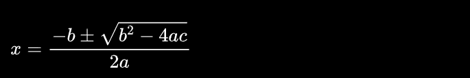

# @cutting/use-mathjax

React components `<MathJax />`, `<SVGMathJax>` and a `useMathJax` hook to easily load [MathJax version 3](https://github.com/mathjax/MathJax-src) Tex content.

A real working demo is [here](https://cutting.scot/viz/sine) which is why I wrote this component.

## install 

```sh
yarn add @cutting/use-mathjax
```

## MathJax components

Probably the easiest way to use `use-mathjax` is to use either the `<MathJax/>` component or the `<SVGMathJax>` component.

### MathJax

`<MathJax/>` is for rendering mathjax expressions into plain old HTML.

```ts
import { MathJax, MathJaxProvider } from '@cutting/use-mathjax';

const Maths = () => {
  return (
    <>
      <MathJax expr={`$$\\int x^2dx$$`} />
      <MathJax expr={`$$\\frac{5\\pi}4$$`} />
      <MathJax expr={`$$\\frac{3\\pi}2$$`} />
    </>
  )
}

export const App: FC = () => {
  return (
    <StrictMode>
      <MathJaxProvider>
        <Maths />
      </MathJaxProvider>
    </StrictMode>
  );
};
```

### SVGMathJax

`<SVGMathJax>` is for rendering mathjax into an existing svg component.

```ts
import { MathJax, MathJaxProvider } from '@cutting/use-mathjax';

const Maths = () => {
  return (
   <svg preserveAspectRatio="xMaxYMid meet" viewBox="0 0 960 654" style="overflow: visible;">
     {[
       { value: Math.PI / 4, label: '$\\frac{\\pi}4$' },
       { value: Math.PI / 2, label: '$\\frac{\\pi}2$' },
      ].map(({ cosX, sinY, label, offsetX, offsetY }) => (
     <g key={label}>
      <SVGMathJax expr={label} />
     </g>
   <svg>
  )
}

export const App: FC = () => {
  return (
    <StrictMode>
      <MathJaxProvider>
        <Maths />
      </MathJaxProvider>
    </StrictMode>
  );
};
```

The `SVGMathJax` component takes an `expr` string prop of MathJax markup.

## MathJaxProvider

Both the `<MathJax/>` and the `<SVGMathJax/>` components and the `useMathJax` hook will fail if the current component is not a descendant of the `MathJaxProvider`:

```ts
export { MathJaxProvider } from '@cutting/use-mathjax';

export const App: FC = () => {
  return (
    <StrictMode>
      <MathJaxProvider>
        <Maths />
      </MathJaxProvider>
    </StrictMode>
  );
};
```

## useMathJax hook

This is a low level hook used by both the `<MathJax/>` and the `<SVGMathJax/>` components 

```ts
import { useMathJax, MathJaxProvider } from '@cutting/use-mathjax';

const Maths = () => {
  const ref = useRef<HTMLParagraphElement>();
  useMathJax({ elements: ref });

  return (
    <p 
      ref={ref}
      className="math"
      dangerouslySetInnerHTML={{
        __html: `
        $$x = {-b \\pm \\sqrt{b^2-4ac} \\over 2a}$$
      `,
      }}
    ></p>
  )
}

export const App: FC = () => {
  return (
    <StrictMode>
      <MathJaxProvider>
        <Maths />
      </MathJaxProvider>
    </StrictMode>
  );
};
```



`useMathJax` takes a configuration object with a fields property that points to an element of an array of elements with MathJax markup.
